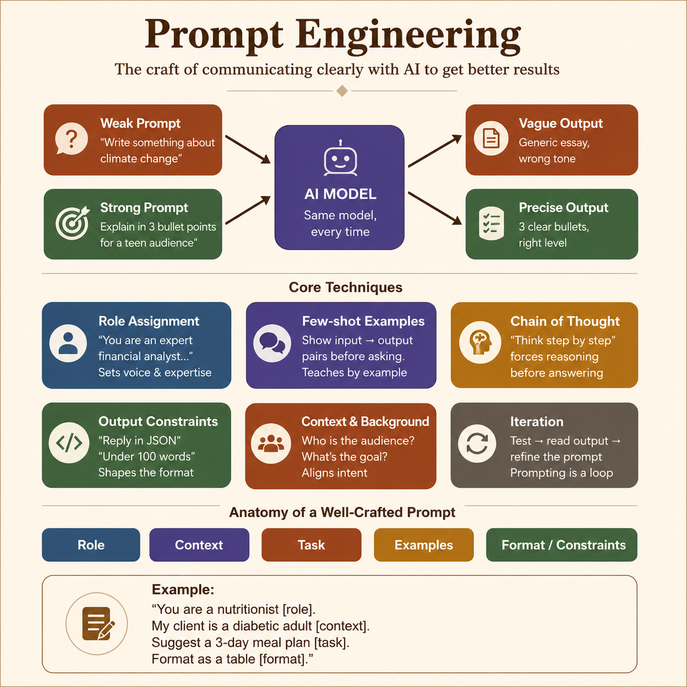
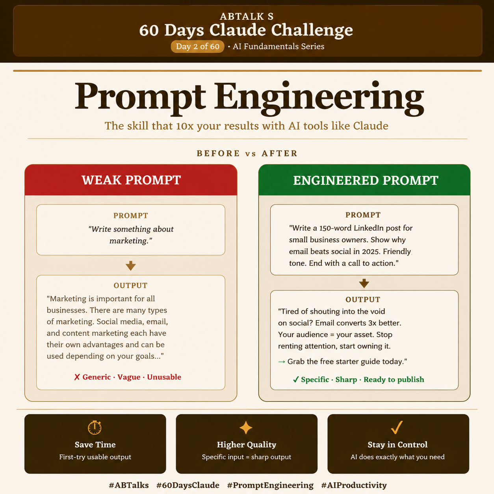

# Day 02 — Prompt Engineering

## Overview

Today I learned about **Prompt Engineering** — the skill of giving AI clear, structured instructions to produce more accurate and goal-aligned results.

I compared a **lazy prompt** with a **structured engineered prompt** inside Claude to observe differences in output quality, explanation style, and visual presentation.

---

## Experiment

### 1. Lazy Prompt

```text
Create an image explaining Prompt Engineering
```

### Output

The lazy prompt generated a detailed educational infographic with strong conceptual depth, prompt techniques, and explanation-focused design.



---

### 2. Engineered Prompt

```text
You are an AI educator teaching complete beginners.
Explain Prompt Engineering in simple language.

Include:
• What Prompt Engineering is
• Why it matters when using AI tools like Claude
• One example of a weak prompt
• One example of an improved prompt
• Three practical benefits of writing better prompts

Also create a LinkedIn-ready image concept.

Image Requirements:
• Square LinkedIn post (1080×1080)
• Claude-inspired brown, beige and cream colors
• Professional and minimal design
• Main title: "Prompt Engineering"
• Show a visual comparison:
  Weak Prompt → Basic Output
  Engineered Prompt → Better Output
• Modern AI and productivity-themed visuals
• Add ABTalks 60 Days Claude Challenge in the heading

Output Format:
Section 1: Explanation
Section 2: Weak vs Improved Prompt Example
Section 3: Detailed Image Generation Prompt
```

### Output

The engineered prompt produced a cleaner, more polished, LinkedIn-ready infographic aligned with the requested style, branding, audience, and formatting constraints.



---

## Key Learnings

✅ Clear prompts reduce ambiguity and guesswork.

✅ Context, audience, and constraints improve output quality.

✅ Prompt Engineering is not about writing longer prompts.

✅ Better prompts create outputs that align more closely with the intended goal.

---

## My Biggest Takeaway

This experiment produced an interesting observation.

The **lazy prompt** delivered stronger educational depth and broader conceptual explanation.

The **engineered prompt** delivered better alignment with the requested objective, visual style, and professional presentation.

**Better prompt ≠ universally better output.**

**Better prompt = better-targeted output.**
