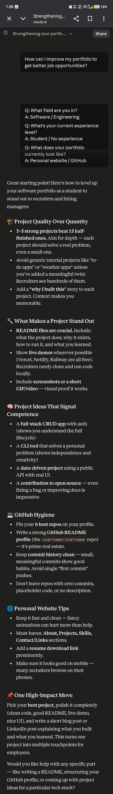
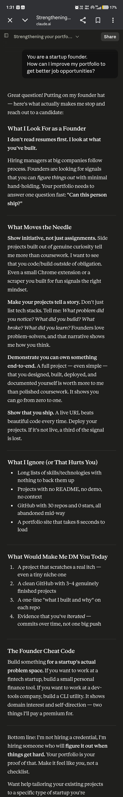
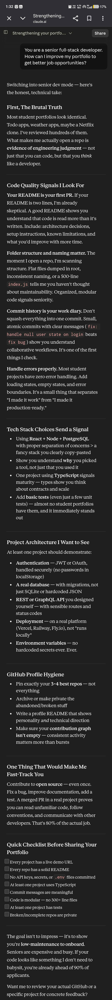
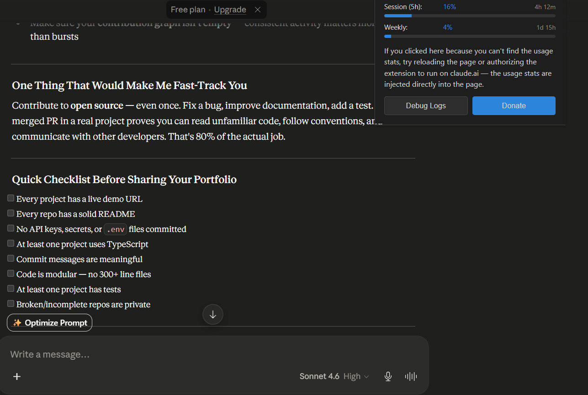

# Day 3 - Role-Based Prompting

## Overview

Today, I explored **Role-Based Prompting**, a prompt engineering technique where an AI is assigned a specific role before answering a question.

The goal was to understand how assigning different personas changes the quality, focus, and depth of AI-generated responses.

---

# Objective

Compare how Claude responds to the same question when:

1. No role is assigned
2. Assigned a Startup Founder persona
3. Assigned a Senior Full-Stack Developer persona

---

# Question Used

> How can I improve my portfolio to get better job opportunities?

---

# Prompt 1 - Without Any Role

## Prompt

```text
How can I improve my portfolio to get better job opportunities?
```

## Summary of Response

The response was broad and beginner-friendly.

Main focus areas:

* Better projects
* GitHub improvements
* Portfolio website enhancements
* Open-source contributions
* Live demos and documentation

### Key Insight

The response provided general career advice that would be useful for someone who is just getting started.

### What I Learned

A general prompt produces a general answer.

The response focused on improving my portfolio overall, but it did not explain how different professionals might evaluate my work.

---

# Prompt 2 - Startup Founder Persona

## Prompt

```text
You are a startup founder.

How can I improve my portfolio to get better job opportunities?
```

## Summary of Response

The response shifted from technology to business impact.

Main focus areas:

* Ownership
* Initiative
* Problem solving
* Product thinking
* Shipping real solutions

### Key Insight

The founder repeatedly focused on one question:

> Can this person build and deliver something valuable?

### What I Learned

Projects should not only demonstrate coding ability.

They should demonstrate:

* Why the project exists
* What problem it solves
* Who it helps
* What impact it creates

A portfolio becomes much stronger when projects tell a story rather than simply listing technologies.

---

# Prompt 3 - Senior Full-Stack Developer Persona

## Prompt

```text
You are a senior full-stack developer.

How can I improve my portfolio to get better job opportunities?
```

## Summary of Response

The response became highly technical and engineering-focused.

Main focus areas:

* Clean architecture
* TypeScript
* Testing
* Security
* Authentication
* Git practices
* Deployment
* Code maintainability

### Key Insight

The perspective changed from:

> What did you build?

to

> How well did you build it?

### What I Learned

Building projects is not enough.

I also need to demonstrate:

* Code quality
* Scalability
* Maintainability
* Security
* Professional development workflows

The response showed me what separates a project that works from a project that looks production-ready.

---

# Response Comparison

| Perspective                 | Primary Focus                                |
| --------------------------- | -------------------------------------------- |
| No Role                     | General portfolio improvement                |
| Startup Founder             | Business value, ownership, and execution     |
| Senior Full-Stack Developer | Engineering quality and technical excellence |

---

# Biggest Observation

The most interesting part of this experiment was that the question never changed.

Only the role changed.

Yet the answers felt like they came from completely different people.

This helped me realize that Role-Based Prompting does not simply change the answer.

It changes the perspective, priorities, assumptions, and decision-making framework used to generate the answer.

---

# What This Means for Me as a Full-Stack Developer & AI Learner

As a developer, I often use AI for technical guidance.

However, this exercise taught me that AI becomes significantly more powerful when I specify the perspective I want.

Instead of asking:

> How can I improve my project?

I can ask:

* As a Founder
* As a Product Manager
* As a Senior Developer
* As a UX Designer
* As a Recruiter
* As an AI Architect

Each role reveals different insights that I might otherwise miss.

---

# Key Takeaways

* Role-Based Prompting improves response relevance.
* Different personas prioritize different aspects of the same problem.
* Founder personas focus on impact and business value.
* Developer personas focus on technical quality and engineering practices.
* AI can simulate multiple expert perspectives for better decision-making.

---

# Final Conclusion

Role-Based Prompting is one of the simplest yet most powerful prompt engineering techniques.

Through this exercise, I learned that AI is not only a tool for generating answers—it can simulate different expert mindsets.

As a Full-Stack Developer and AI Learner, I can use Role-Based Prompting to gain technical, business, product, and career perspectives on the same problem, leading to more informed decisions and higher-quality outcomes.

## My Biggest Takeaway

> The quality of AI output is not only determined by the question you ask, but also by the perspective you ask it from.

---

## Screenshots

* Output of prompt without role
  
  
* Founder persona response
  
  
* Senior Full-Stack Developer persona response
  
  
* Claude Usage Counter extension
  
