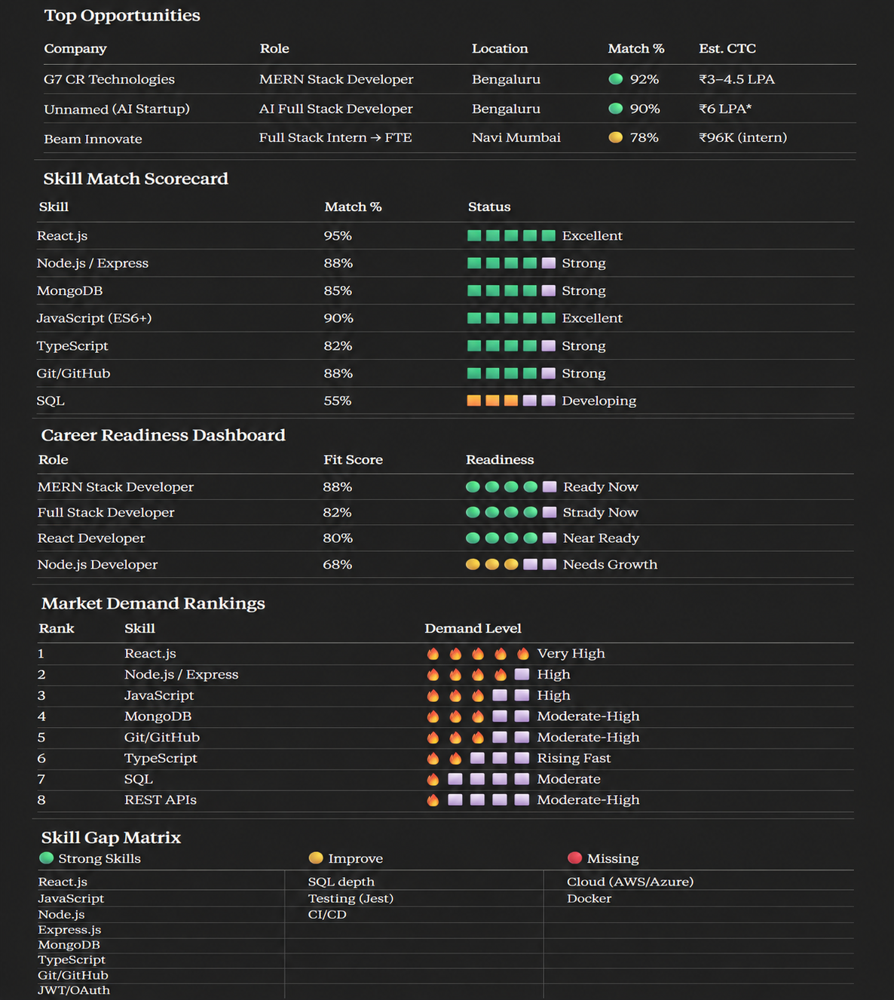

# Day 13 — Claude Connectors: AI Job Search Assistant

## Objective

Learn how Claude Connectors can integrate with external platforms to automate job discovery, opportunity analysis, skill-gap identification, and career planning.

---

## What I Built

For Day 13 of the 60 Day Claude Challenge, I connected Claude with Indeed using Claude Connectors and transformed it into an AI-powered job search assistant.

Instead of manually searching through job portals, I used AI to:

* Discover matching job opportunities
* Analyze role suitability
* Evaluate market demand
* Identify skill gaps
* Generate career insights

---

## Workflow

🔗 Claude Connectors
→ 💼 Indeed Integration
→ 🎯 Job Discovery
→ 📊 Market Analysis
→ 🧠 Skill Gap Analysis
→ 🚀 Career Insights

---

## Analysis Performed

Claude analyzed my profile against live job opportunities and provided:

### Job Discovery

* Matching Full Stack Developer opportunities
* MERN Stack Developer opportunities
* React Developer opportunities
* Entry-level software engineering roles

### Market Analysis

* Current demand for React.js
* Demand for Node.js and Express.js
* Demand for JavaScript and TypeScript
* Industry trends for Full Stack Developers

### Skill Gap Identification

Strong Skills:

* React.js
* JavaScript
* Node.js
* Express.js
* MongoDB
* TypeScript
* Git/GitHub
* JWT/OAuth

Skills To Improve:

* SQL Depth
* Testing (Jest)
* CI/CD

Skills Missing From Most Job Requirements:

* Cloud (AWS/Azure)
* Docker

---

## Key Learning

Most developers ask:

"What should I learn next?"

Claude helped answer a better question:

"What skills does the market currently demand?"

Using real job market data provided a clearer roadmap for skill development and career planning.

---

## Outcome

* Discovered matching opportunities
* Evaluated career readiness
* Identified market demand trends
* Built a data-driven learning roadmap
* Learned how AI can support career decisions beyond coding tasks

---

## Screenshots

### AI Job Market Analysis Dashboard

---

## Conclusion

Claude Connectors demonstrated how AI can move beyond content generation and become a practical career assistant.

By combining Claude with Indeed, I was able to analyze opportunities, understand market demand, and identify the most valuable skills to focus on next.

This exercise showed how AI can help make smarter and more informed career decisions.
